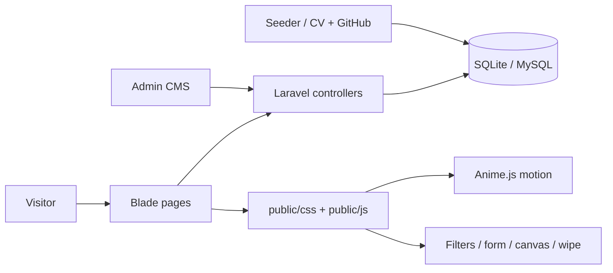

<p align="center">
  
</p>

<h1 align="center">HASIN</h1>

<p align="center">
  <strong>Personal portfolio of Md. Shadman Hasin</strong><br/>
  Software Developer · CSE graduate · Dhaka<br/>
  Laravel CMS · Lagoon Forge design · live on Render
</p>

<p align="center">
  <a href="https://full-stack-dynamic-portfolio1.onrender.com">Live Site</a> ·
  <a href="#quick-start">Quick Start</a> ·
  <a href="#features">Features</a> ·
  <a href="#architecture">Architecture</a> ·
  <a href="#repository-map">Repository Map</a> ·
  <a href="#owner">Owner</a>
</p>

---

## Why this exists

Static portfolios go stale the moment you ship a new project.  
**HASIN** is a full personal portfolio **with an admin CMS** — so projects, about copy, socials, resume, and messages stay editable without touching code.

It is built to feel like a product, not a template dump: brand-first hero, logo wipe between pages, live work filters, and a design system that is not flat white “premium.”

| | |
|---|---|
| **Owner** | Md. Shadman Hasin only — personal portfolio |
| **Live** | [full-stack-dynamic-portfolio1.onrender.com](https://full-stack-dynamic-portfolio1.onrender.com) |
| **CMS** | Admin panel for projects, skills, experiences, messages, settings |
| **Design** | Lagoon Forge — deep teal void, copper forge accent, Syne + Outfit |

---

## Live site

**https://full-stack-dynamic-portfolio1.onrender.com**

> Free Render instances sleep when idle. The first visit after a pause can take 30–60 seconds to wake.

Use that URL on your resume, LinkedIn, and GitHub profile — not a local `127.0.0.1` or temporary tunnel link.

---

## Quick start

### Requirements

- PHP 8.2+
- Composer
- SQLite (default) or MySQL

### Install & run

```bash
git clone https://github.com/Hasin-99/hasin-portfolio.git
cd hasin-portfolio

composer install
cp .env.example .env
touch database/database.sqlite

php artisan key:generate
php artisan migrate --seed
php artisan storage:link
php artisan serve
```

Open [http://127.0.0.1:8000](http://127.0.0.1:8000).

### Admin (after seed)

| | |
|---|---|
| URL | `/admin/login` |
| Email | `md.shadmanhasin520k82@gmail.com` |
| Password | `Hasin@Portfolio2026` |

Change the password after first login if the site is public.

---

## Features

### Public site

- **Home** — HASIN brand hero, selected work, kinetic motion, signal lattice canvas
- **Work** — full archive with live category filters + search
- **Project pages** — editorial **field notes** (opening line → story → proof), then stack and links
- **About** — skills, path, education (no GPA), certifications
- **Contact** — live validation, copy email, phone links, full socials
- **SEO** — `robots.txt` + `sitemap.xml` (includes all active project URLs)
- **Errors** — branded 403 / 404 / 419 / 500 pages
- **Logo wipe** — special HASIN mark between page loads
- **Responsive** — mobile nav with Resume, breakpoints across pages

### Admin CMS (`/admin`)

- Dashboard stats
- Projects / skills / experiences CRUD (field-note fields on projects)
- Contact message inbox
- Profile, about copy, socials, resume & photo uploads

### Socials wired in

GitHub · LinkedIn · Facebook · Instagram · X · Threads · Telegram · WhatsApp · Email · Phone

---

## Architecture

Content lives in the database. The public site reads it; the admin writes it.



### Request path

```text
Browser
  → Nginx (Render) / php artisan serve (local)
  → public/index.php
  → routes/web.php
  → Home / About / Works / Contact / Admin controllers
  → Blade views + Eloquent models
```

### Design system

**Lagoon Forge**

| Token | Role |
|-------|------|
| Deep teal void (`#071416`) | Background |
| Copper forge (`#f0753a`) | Signal / CTAs |
| Cool mist (`#e4f2f0`) | Body text |
| Patina teal (`#3db8a8`) | Secondary accent |
| Syne + Outfit | Display + body fonts |

---

## Repository map

| Path | Role |
|------|------|
| [`app/`](./app) | Controllers, models, middleware, providers |
| [`database/seeders/`](./database/seeders) | CV + GitHub project seed data |
| [`database/data/project_thinking.php`](./database/data/project_thinking.php) | Field-note copy for each project |
| [`public/css/`](./public/css) | Lagoon Forge styles |
| [`public/js/`](./public/js) | Wipe, filters, form UX, canvas, logo |
| [`public/sitemap.xml`](./public/sitemap.xml) | Generated sitemap (also rebuilt on deploy) |
| [`resources/views/`](./resources/views) | Public pages + admin + error pages |
| [`Dockerfile`](./Dockerfile) | Production image for Render |
| [`render.yaml`](./render.yaml) | Render Blueprint config |
| [`deploy/render-start.sh`](./deploy/render-start.sh) | Migrate / seed / sitemap / cache on boot |

---

## Deploy on Render

This repo is already wired for Docker on Render.

1. [dashboard.render.com](https://dashboard.render.com) → **Web Service** → connect this GitHub repo  
2. Runtime: **Docker** · Branch: **main** · Root Directory: empty  
3. Set env vars:

| Key | Value |
|-----|--------|
| `APP_KEY` | from `php artisan key:generate --show` |
| `APP_URL` | `https://full-stack-dynamic-portfolio1.onrender.com` |
| `APP_ENV` | `production` |
| `APP_DEBUG` | `false` |
| `DB_CONNECTION` | `sqlite` |
| `WEBROOT` | `/var/www/html/public` |
| `RUN_SCRIPTS` | `1` |
| `SKIP_COMPOSER` | `1` |

4. Deploy → wait for **Live**  
5. On boot, `deploy/render-start.sh` runs migrations, rebuilds `sitemap.xml` (`php artisan portfolio:build-sitemap`), and caches config/routes/views

---

## Troubleshooting

| Problem | Fix |
|---------|-----|
| Blank / slow first load on Render | Free tier is waking from sleep — wait ~1 minute |
| CSS/JS 404 after deploy | Confirm `WEBROOT=/var/www/html/public` and `APP_URL` is your https onrender URL |
| Admin login fails after fresh DB | Re-run `php artisan migrate:fresh --seed` locally, or check seeded credentials above |
| Contact form “Page Expired” | Refresh the page (CSRF token) and submit again |
| Changes not showing | `php artisan view:clear` · hard-refresh browser |

---

## Owner

Personal portfolio of **Md. Shadman Hasin**.

| | |
|---|---|
| **Role** | Software Developer |
| **Education** | BSc in CSE, Daffodil International University |
| **Based in** | Dhaka, Bangladesh |
| **Email** | [md.shadmanhasin520k82@gmail.com](mailto:md.shadmanhasin520k82@gmail.com) |
| **GitHub** | [github.com/Hasin-99](https://github.com/Hasin-99) |
| **LinkedIn** | [Md. Shadman Hasin](https://www.linkedin.com/in/md-shadman-hasin-648587333) |
| **WhatsApp** | [wa.me/8801764851551](https://wa.me/8801764851551) |
| **Live site** | [full-stack-dynamic-portfolio1.onrender.com](https://full-stack-dynamic-portfolio1.onrender.com) |

---

## License

© Md. Shadman Hasin. All rights reserved.  
Proprietary personal portfolio — do not copy the design, copy, or content without permission.

---

<p align="center">
  <em>Transit apps. Banking ledgers. Clinical models. A Bangla compiler.</em><br/>
  <strong>HASIN · Dhaka</strong>
</p>
